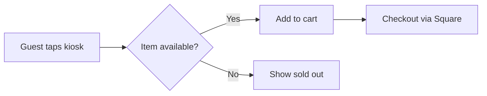

<Note>
  This is a **hidden** reference page. It is not listed in `docs.json`, so it never appears in the
  sidebar or search nav, but it is reachable directly at `/component-showcase`. Use it as a living
  playground for every Mintlify component.
</Note>

## Accordions

<AccordionGroup>
  <Accordion title="What is Lumina?" icon="circle-help">
    Lumina turns any iPad into a self-ordering kiosk powered by Square.
  </Accordion>
  <Accordion title="How do I get started?" icon="rocket">
    See the [Quick Start](/quick-start) guide.
  </Accordion>
</AccordionGroup>

## Badge

Inline status labels: <Badge color="green">Active</Badge> <Badge color="yellow">Beta</Badge> <Badge color="red">Deprecated</Badge>

<Badge size="xs">xs</Badge> <Badge size="sm">sm</Badge> <Badge size="md">md</Badge> <Badge size="lg">lg</Badge> <Badge shape="pill" color="blue">pill</Badge>

## Banner

The banner is a site-wide element configured via the `banner` property in `docs.json` rather than an
inline component. Example configuration:

```json docs.json
"banner": {
  "content": "🚀 Version 2.0 is now live! See our [changelog](/changelog) for details.",
  "type": "info",
  "dismissible": true
}
```

## Callouts

<Note>This is a note callout.</Note>
<Tip>This is a tip callout.</Tip>
<Info>This is an info callout.</Info>
<Warning>This is a warning callout.</Warning>
<Check>This is a check callout.</Check>
<Danger>This is a danger callout.</Danger>

## Cards

<Card title="Quick Start" icon="rocket" href="/quick-start">
  Set up your kiosk and take your first order.
</Card>

<CardGroup cols={2}>
  <Card title="Menu Management" icon="utensils" href="/menu-management">
    Build and edit your menu.
  </Card>
  <Card title="Loyalty" icon="star" href="/loyalty">
    Reward repeat guests.
  </Card>
</CardGroup>

## Code groups

<CodeGroup>

```bash npm
npm install @lumina/kiosk
```

```bash pnpm
pnpm add @lumina/kiosk
```

```bash yarn
yarn add @lumina/kiosk
```

</CodeGroup>

## Color

<Color variant="compact">
  <Color.Item name="primary" value="#0027F5" />
  <Color.Item name="light" value="#1BE7FF" />
  <Color.Item name="dark" value="#E6FF4F" />
</Color>

<Color variant="table">
  <Color.Row title="Brand">
    <Color.Item name="primary-500" value="#0027F5" />
    <Color.Item name="primary-600" value="#001FC4" />
  </Color.Row>
  <Color.Row title="Theme-aware">
    <Color.Item name="bg" value={{ light: "#FFFFFF", dark: "#000000" }} />
  </Color.Row>
</Color>

## Columns

<Columns cols={2}>
  <Card title="Left" icon="arrow-left">First column content.</Card>
  <Card title="Right" icon="arrow-right">Second column content.</Card>
</Columns>

## Expandables

<ResponseField name="guest" type="object">
  A guest record.

  <Expandable title="properties">
    <ResponseField name="name" type="string">The guest's name.</ResponseField>
    <ResponseField name="loyaltyId" type="string">Loyalty program identifier.</ResponseField>
  </Expandable>
</ResponseField>

## Fields

<ParamField path="menuId" type="string" required>
  The unique identifier for the menu.
</ParamField>

<ParamField query="includeArchived" type="boolean" default="false">
  Whether to include archived items.
</ParamField>

## Frames

<Frame caption="A framed image with a caption">
  
</Frame>

## Icons

Inline icons from the Lucide library: <Icon icon="rocket" /> <Icon icon="star" color="#0027F5" /> <Icon icon="utensils" size={24} />

## Mermaid diagrams



## Panel

The `<Panel>` below customizes the right-hand sidebar. It also holds the `RequestExample` and
`ResponseExample` (the **Examples** component) — required to live inside the panel when a page has one.

<Panel>
  <Info>Pinned to the side panel. You can add any component here.</Info>

  <RequestExample>

  ```bash Request
  curl --request POST \
    --url https://api.onlumina.com/v1/orders
  ```

  </RequestExample>

  <ResponseExample>

  ```json Response
  { "status": "success", "orderId": "ord_123" }
  ```

  </ResponseExample>
</Panel>

## Prompt

<Prompt description="Generate clear, concise documentation." icon="paperclip" actions={["copy", "cursor"]}>
You are a **technical writing assistant**. Write documentation that is clear, accurate, and concise.
- Use second-person voice ("you") and active verbs.
- Start procedures with a goal-oriented heading.
</Prompt>

## Responses

<ResponseField name="orderId" type="string" required>
  The unique identifier of the created order.
</ResponseField>

<ResponseField name="total" type="number">
  The order total in cents.
</ResponseField>

## Steps

<Steps>
  <Step title="Connect Square" icon="link">
    Link your Square account to Lumina.
  </Step>
  <Step title="Build your menu" icon="utensils">
    Import or create your menu items.
  </Step>
  <Step title="Go live" icon="circle-check">
    Launch the kiosk and take your first order.
  </Step>
</Steps>

## Tabs

<Tabs>
  <Tab title="iPad">
    Lumina runs on any modern iPad.
  </Tab>
  <Tab title="Square">
    Square handles menus, pricing, and payments.
  </Tab>
</Tabs>

## Tiles

<Columns cols={2}>
  <Tile href="/quick-start" title="Quick Start" description="Set up in minutes">
    
  </Tile>
  <Tile href="/menu-management" title="Menu" description="Manage your items">
    
  </Tile>
</Columns>

## Tooltips

<Tooltip headline="API" tip="Application Programming Interface: a set of protocols for software to communicate." cta="Read our API guide" href="/quick-start">API</Tooltip> documentation helps developers integrate with Lumina.

## Tree

<Tree>
  <Tree.Folder name="menu" defaultOpen>
    <Tree.File name="items.json" />
    <Tree.File name="categories.json" />
    <Tree.Folder name="images">
      <Tree.File name="latte.png" />
      <Tree.File name="matcha.png" />
    </Tree.Folder>
  </Tree.Folder>
  <Tree.File name="docs.json" />
</Tree>

## Update

<Update label="2026-06-15" description="v2.0.0" tags={["Lumina"]}>
  ## Component showcase added

  You can add anything here — a screenshot, a code snippet, or a list of changes.

  - Responsive design
  - Anchor for each update
  - Generated RSS feed entry for each update
</Update>

## View

The `<View>` component switches content based on a multi-view dropdown configured in `docs.json`
navigation. The selector only appears once that dropdown is configured.

<View title="JavaScript" icon="js">
  This content only appears when you select JavaScript.

  ```javascript
  console.log("Hello from JavaScript!");
  ```
</View>

<View title="Python" icon="python">
  This content only appears when you select Python.

  ```python
  print("Hello from Python!")
  ```
</View>

## Visibility

<Visibility for="humans">
  <Note>
    You are viewing this content **in web**. It renders normally on the standard page and is excluded
    from the Markdown (`.md`) output.
  </Note>
</Visibility>

<Visibility for="agents">
  > You are viewing this content **in Markdown**. It only appears in the `.md` version of the page,
  > intended for AI agents.
</Visibility>
